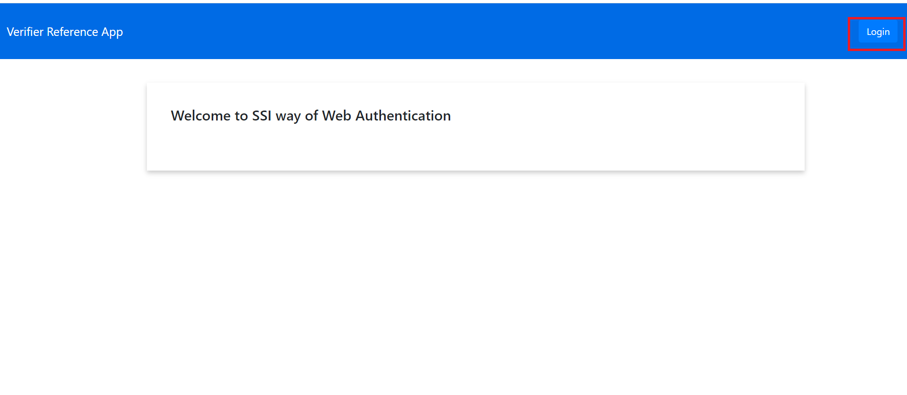
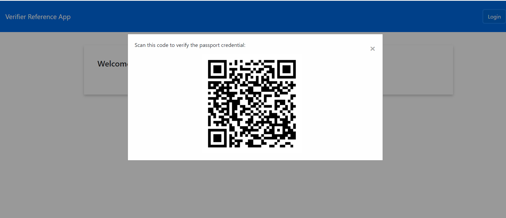
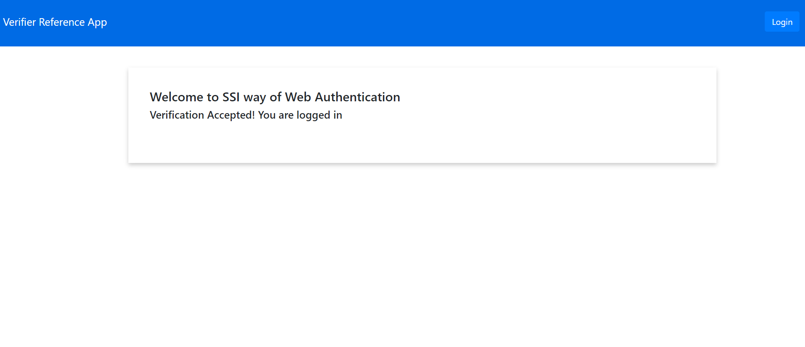

# Trinsic's Verifier Reference App
This demo shows an alternative to username and password login and request a connectionless verification.
It is a Node.js Express app which makes Trinsic Credential API calls.

## Use Case
This sample is to simulate a request of proof for web authentication

## Prerequisites:
- [npm](https://www.npmjs.com/get-npm)
- The Trinsic Wallet app. Download the [Android](https://play.google.com/store/apps/details?id=id.streetcred.apps.mobile) or [iOS](https://apps.apple.com/us/app/trinsic-wallet/id1475160728) version for free and set up an account

## Setup

### Download project and install dependencies
 1. Clone the repository
 `git clone https://github.com/Anushka3174/SSIVerifierApp.git`
 2. Navigate into the directory
 `cd SSIVerifierApp`
 3. Install the dependencies
 `npm install`
 4. Open up the project in a code editor of your choice

## Run the web app

### Start and use the application
1. Run with npm.
`npm start`
2. Open the web app on <a href="http://localhost:3000" target="_blank">localhost:3000</a>, and fill in the desired passport information.
3. On the top left, you will see a login button. Click on it 
4. You will see a QR code on the screen. This QR code is asking you to present certain attributes that are required to login.

7. On the Trinsic Wallet mobile app, present the desired information.
8. In the web app, the QR code modal will close, and the verified information will be displayed.

